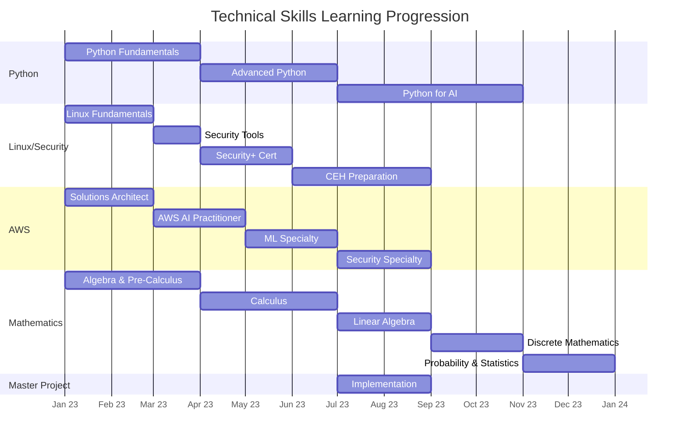

# Technical Study Plan

## Learning Path Timeline

## Month-by-Month Skills Progression

|Month|Python|Linux/Cybersecurity|AWS|Mathematics|
|---|---|---|---|---|
|1|Python Fundamentals|Linux Fundamentals|Solutions Architect|Algebra & Pre-Calculus|
|2|Python Fundamentals|Linux Fundamentals|Solutions Architect|Algebra & Pre-Calculus|
|3|Python Fundamentals|Security Tools|AWS AI Practitioner|Algebra & Pre-Calculus|
|4|Advanced Python|Security+|AWS AI Practitioner|Calculus|
|5|Advanced Python|Security+|ML Specialty|Calculus|
|6|Advanced Python|CEH Prep|ML Specialty|Calculus|
|7|Python for AI|CEH Prep|Security Specialty|Linear Algebra|
|8|Python for AI|CEH Prep|Security Specialty|Linear Algebra|
|9|Python for AI|CEH Certification|AWS Review|Discrete Mathematics|
|10|Python for AI|Security Practice|AWS Projects|Discrete Mathematics|
|11|Python Projects|Security Practice|AWS Projects|Probability & Statistics|
|12|Python Projects|Security Practice|AWS Projects|Probability & Statistics|

## Daily Study Schedule (4 Hours)

- **Python**: 1 hour
- **Linux/Cybersecurity**: 1 hour
- **AWS**: 1 hour
- **Mathematics**: 1 hour

## Key Learning Paths

### Python (10 Months)

1. **Fundamentals** (Months 1-3)
    - Data types, loops, conditionals, functions
    - NumPy and Pandas basics
    - Capstone: Port scanner
2. **Advanced** (Months 4-6)
    - OOP, CLI tools, security libraries
    - Capstone: SSH brute-forcer
3. **AI** (Months 7-10)
    - TensorFlow, Scikit-learn, NLP
    - Capstone: Log analyzer with NLP

### Linux/Cybersecurity (8 Months)

1. **Linux Fundamentals** (Months 1-2)
    - Command-line, file permissions, networking
    - Capstone: Automated port scanning script
2. **Security Tools** (Month 3)
    - Nmap, Wireshark, server hardening
    - Capstone: Hardened Linux server setup
3. **Security+** (Months 4-5)
    - Threats, identity management, cryptography
4. **CEH Preparation** (Months 6-8)
    - Penetration testing techniques
    - Capstone: Network penetration test

### AWS (8 Months)

1. **Solutions Architect** (Months 1-2)
    - EC2, S3, VPC, IAM
    - Capstone: Secure cloud architecture
2. **AI Practitioner** (Months 3-4)
    - AWS AI services
    - Capstone: Reconnaissance chatbot
3. **Machine Learning** (Months 5-6)
    - SageMaker, model training
    - Capstone: Vulnerability detection model
4. **Security Specialty** (Months 7-8)
    - Cloud security, Well-Architected framework

### Mathematics (12 Months)

1. **Algebra & Pre-Calculus** (Months 1-3)
    - Number properties, functions, transformations
2. **Calculus** (Months 4-6)
    - Limits, differentiation, integration
3. **Linear Algebra** (Months 7-8)
    - Vectors, matrices, eigenvalues
4. **Discrete Mathematics** (Months 9-10)
    - Logic, set theory, graph theory
5. **Probability & Statistics** (Months 11-12)
    - Distributions, hypothesis testing, Bayesian methods

## Master Project

**Fully Automated Ethical Hacking AI Agent**

- AI-powered reconnaissance
- NLP-based vulnerability detection
- Automated exploitation testing
- Comprehensive reporting
- AWS cloud deployment